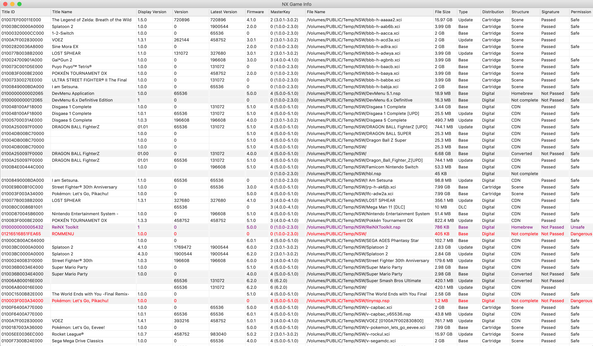
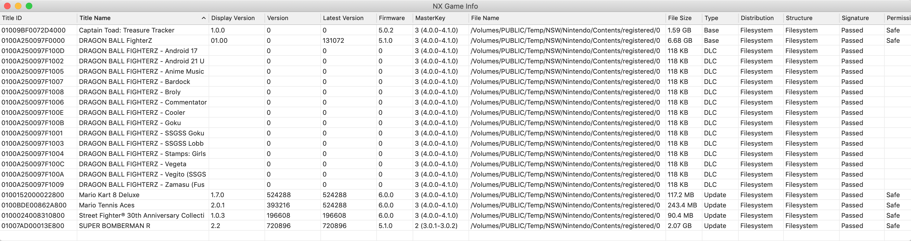
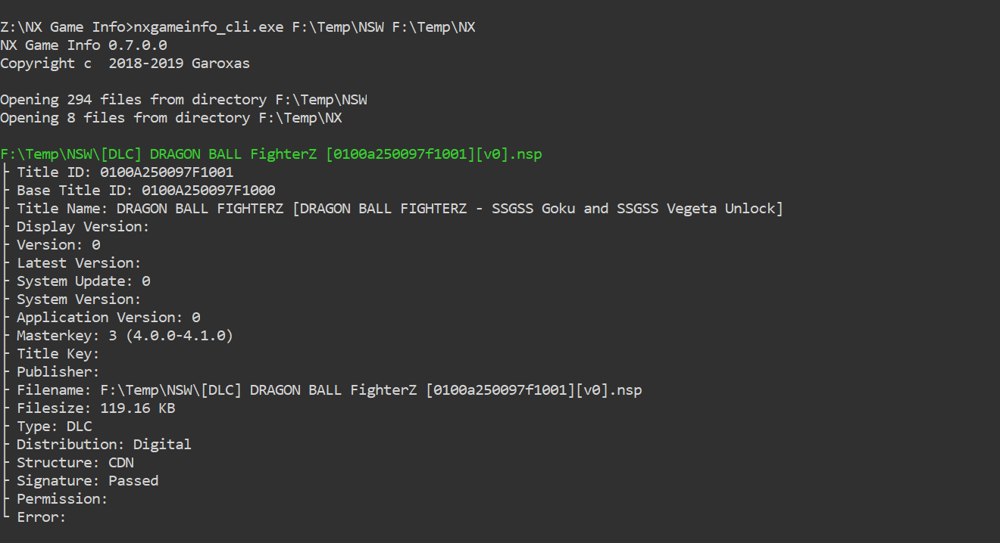
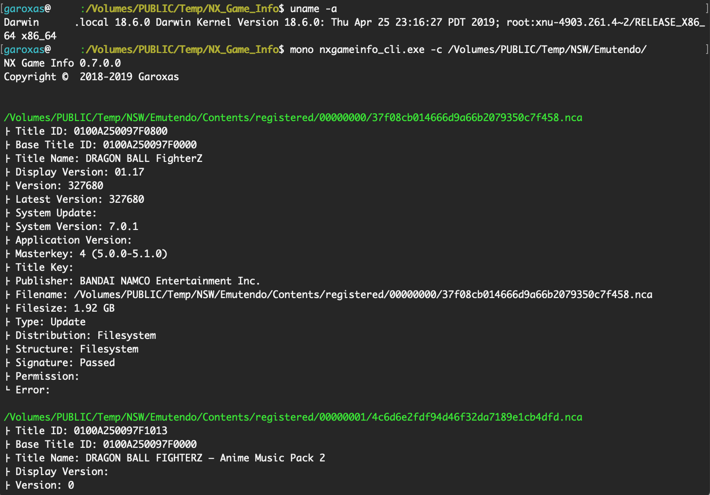
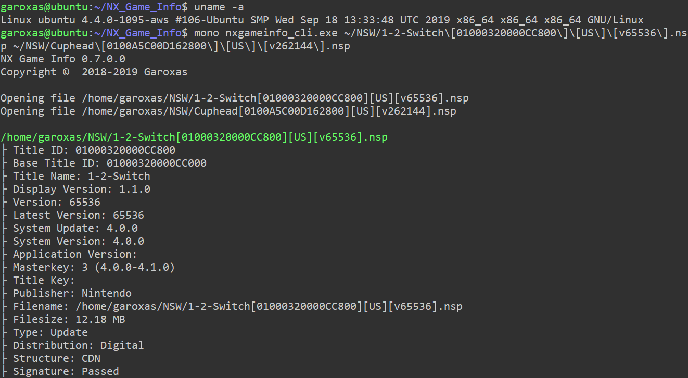

# NX Game Info

> **Note:** This is a modernized version of [NX_Game_Info](https://github.com/garoxas/NX_Game_Info) originally created by Garoxas.
> Upgraded to .NET 9 with updated LibHac and dependencies. Supports macOS GUI and cross-platform CLI.
> See [CREDITS.md](CREDITS.md) for full attribution and changes.

## ⚠️ Important Notes

- **Windows GUI has been removed** from the main branch. macOS GUI and cross-platform CLI remain fully supported.
- **Settings are NOT compatible** with previous builds. Configuration must be redone.
- **Requires .NET 9** Runtime or SDK (no longer uses .NET Framework or Mono).
- **Windows GUI work** is experimental/speculative and maintained in a separate branch (unsupported).

## Features
- **macOS GUI application** and **cross-platform CLI** (Windows, macOS, Linux)
- NSP, XCI, NRO and installed titles on Switch SD card
- Game files structure (Scene Release, CDN Rip, Authoring Tool, Converted from other formats)
- NCA signature to verify official Nintendo titles. Unmodified titles should pass this verification, although titles converted from other formats will not
- Filesystem services permissions. Game titles should not have excessive permissions, and only trust titles with `Unsafe` and `Dangerous` from reliable source

# Repository Layout
- `src/` – Modernized core library (`NX.GameInfo.Core`) and cross-platform CLI (`NX.GameInfo.Cli`).
- `macOS/` – Platform shell project that references the core library.
- `tests/` – xUnit test suite covering metadata extraction and regression scenarios.
- `tools/` – Internal helper scripts (build automation, manifest/triage utilities) and their Python dependencies.
- `docs/` – Guides, reports, and internal notes grouped by purpose.
- `reference/`, `NX_Game_Info/`, `TaskDialog/` – Legacy snapshots kept for parity checks and historical context.

# Information
- Title ID
- Base Title ID
- Title Name
- Display Version
  - Only available for `Base` and `Update`
- Version
- Latest Version
  - Latest title version sourced from the community-maintained [blawar/titledb](https://github.com/blawar/titledb) dataset (`versions.json`)
- System Update
  - *XCI:* System version on `Update Partition`
  - *NSP:* `RequiredSystemVersion` from Metadata XML
- System Version
  - Minimum system version from [Metadata NCA](https://switchbrew.org/wiki/CNMT#Application_Extended_Header). Only available for `Base` and `Update`
- Application Version
  - Minimum application version from [Metadata NCA](https://switchbrew.org/wiki/CNMT#AddOnContent_Extended_Header). Only available for `DLC`
- MasterKey
- Title Key
- Publisher
  - Only available for `Base` and `Update`
- Languages
  - List of language codes as specified by [RFC 5646](https://tools.ietf.org/html/rfc5646). Only available for `Base` and `Update`
- File Name
- File Size
- Type
  - *Base*
  - *Update*
  - *DLC*
- Distribution
  - *Digital:* eShop titles (NSP)
  - *Cartridge:* Gamecard titles (XCI)
  - *Homebrew:* Homebrew titles (NRO)
  - *Filesystem:* Installed titles on Switch SD card (NAX0)
- Structure
  - *Scene (for XCI files):* XCI files with `Update Partition`, `Normal Partition` and `Secure Partition`
  - *Converted (for XCI files):* XCI files with only `Secure Partition`. Commonly found in NSP converted to XCI files
  - *Scene (for NSP files):* NSP files with `legalinfo.xml`, `nacp.xml`, `programinfo.xml`, `cardspec.xml`. Commonly found in BBB Scene Release
  - *Homebrew (for NSP files):* NSP files with `authoringtoolinfo.xml`
  - *CDN (for NSP files):* NSP files with `cert` and `tik`. Commonly found in NSP files ripped from the eShop CDN server
  - *Converted (for NSP files):* NSP files without cert and tik. Commonly found in XCI converted to NSP files
  - *Filesystem (for SD Card files):* NAX0 files installed titles on Switch SD card
  - *Not complete:* XCI/NSP files with only `NCA` files
- Signature
  - *Passed:* NCA signature valid. Only available for official titles
  - *Not Passed:* NCA signature invalid. `Should only be for homebrew titles and not official titles`
- Permission
  - *Safe:* Titles without Filesystem services access or [permissions bitmask 0x8000000000000000](https://switchbrew.org/wiki/Filesystem_services#Permissions) unset
  - *Unsafe:* Titles with Filesystem services access and [permissions bitmask 0x8000000000000000](https://switchbrew.org/wiki/Filesystem_services#Permissions) set. `Has EraseMmc permission, should only be for homebrew titles and not game titles`
  - *Dangerous:* Titles with Filesystem services access and [permissions bitmask 0xffffffffffffffff](https://switchbrew.org/wiki/Filesystem_services#Permissions) set. `Has all permissions, should only be for homebrew titles and not game titles`
  - Only available for `Base` and `Update`

# How to
NX Game Info uses `prod.keys`, `title.keys` and `console.keys` in the format as defined in https://github.com/garoxas/LibHac/blob/NX_Game_Info/KEYS.md and an optional `hac_versionlist.json` built from [blawar/titledb](https://github.com/blawar/titledb).

 - *prod.keys*: Mandatory keys includes `header_key`, `aes_kek_generation_source`, `aes_key_generation_source`, `key_area_key_application_source` and `master_key_00`. Failing to provide these keys will make the application quit
  `master_key_##`, `key_area_key_application_##` and `titlekek_##` will also be necessary to decrypt titles with higher MasterKey requirement
 - *title.keys*: Optional, required for `Permission` check if `.tik` file not available
 - *console.keys*: Optional, `sd_seed` key required for `Open SD Card` feature
 - *hac_versionlist.json*: Optional, required for `Latest Version` feature. Run the CLI with `-V|--refresh-version-list` to download the latest `versions.json` snapshot from blawar/titledb into your key directory.

The application will look for these files at the following locations (other file locations will follow wherever `prod.keys` file was found)

 - Directory of the executable file (.exe) for Windows or (.app) for macOS
 - `$HOME/.switch` e.g. C:\\Users\\_yourname_\\.switch for Windows, /Users/_yourname_/.switch for macOS or /home/_yourname_/.switch for Linux

 `Export` menu supports exporting current list to either `CSV` or `XLSX`. For `CSV` file, default delimiter to use is `comma ( , )` and user defined character can be set in `user.settings` by specifying the delimiter character in `CsvSeparator` field

 Compressed NCA is not supported, but there is an option to make the application accept `XCZ` and `NSZ` file extension by setting `NszExtension` field in `user.settings`. Please note that issues related to these file extensions will not be supported

# macOS GUI
> Requires macOS 12.0 or later with Xcode installed. After installing Xcode, run `sudo xcodebuild -license` once to accept the Apple SDK license before building or launching the app.
### Open File/Directory

### Open SD Card


# Windows GUI (Not Available)

> **⚠️ Windows GUI builds are NOT supported in the main branch.**
>
> Experimental Windows GUI work exists in a separate branch but is incomplete and unsupported.
> Windows users should use the **Command Line Interface** instead (see below).

# Command Line Interface (Windows, macOS, Linux)
### Usage

The CLI targets .NET 9 and no longer requires Mono.

#### Development
```bash
dotnet run --project src/NX.GameInfo.Cli/NX.GameInfo.Cli.csproj -- [options] paths...
```

#### Published binaries
- **Windows:** `NX.GameInfo.Cli.exe [options] paths...`
- **macOS / Linux:** `./NX.GameInfo.Cli [options] paths...`

#### Parameters
- -h|--help
  - Show help message and immediately exit
- -d|--debug
  - Print debug output to `debug.log`
- -c|--sdcard
  - Treat arguments passed in `paths` parameters as installed titles on Switch SD card
- -s|--sort
  - Sort output by one of the following options:
    - `titleid`
    - `titlename`
    - `filename` (default)
- -z|--nsz
  - Enable `XCZ` and `NSZ` extension
- -V|--refresh-version-list
  - Download the latest `hac_versionlist.json` (blawar/titledb `versions.json`) to populate the `Latest Version` column before scanning
- paths
  - File or directory path, can pass multiple arguments

### Windows
Install the latest .NET 9 Runtime or SDK:  
https://dotnet.microsoft.com/download/dotnet



### macOS
Install the latest .NET 9 Runtime or SDK:  
https://dotnet.microsoft.com/download/dotnet



### Linux (Ubuntu)
Install the latest .NET 9 Runtime or SDK:  
https://dotnet.microsoft.com/download/dotnet



# Credits

See [CREDITS.md](CREDITS.md) for full attribution and license information.

**Key acknowledgments:**
- **Garoxas** - Original NX_Game_Info author
- **@Thealexbarney** - [LibHac](https://github.com/Thealexbarney/LibHac) library
- **@switchbrew** - [Nintendo Switch documentation](https://switchbrew.org)
- **@gibaBR** - [Switch-Backup-Manager](https://github.com/gibaBR/Switch-Backup-Manager) project
